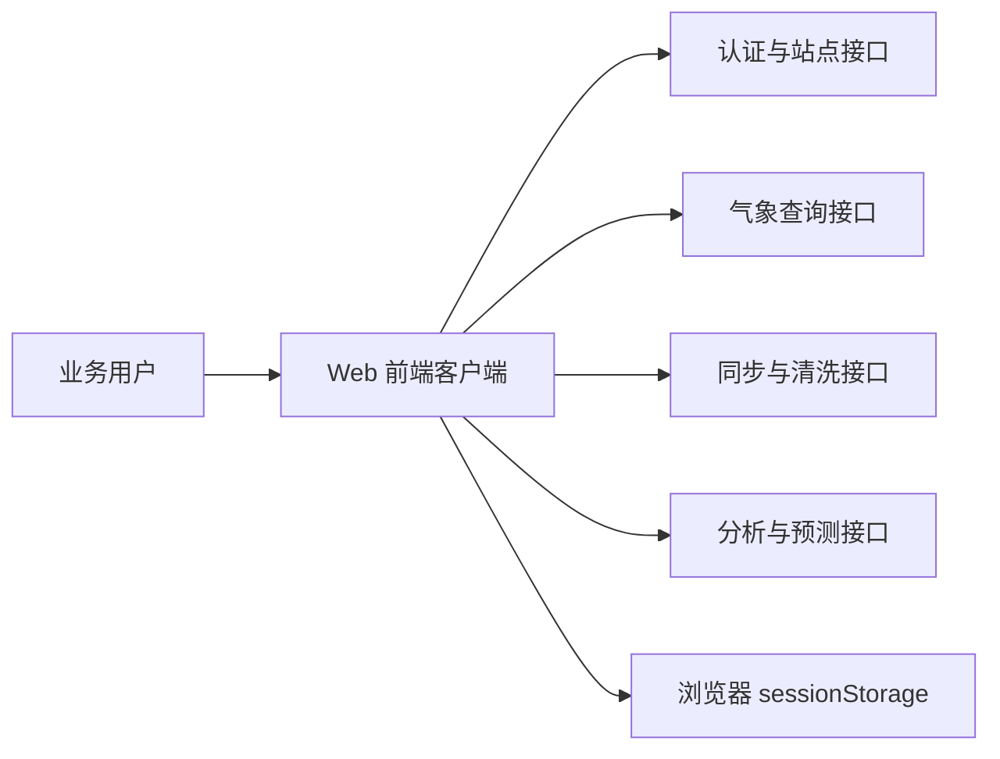
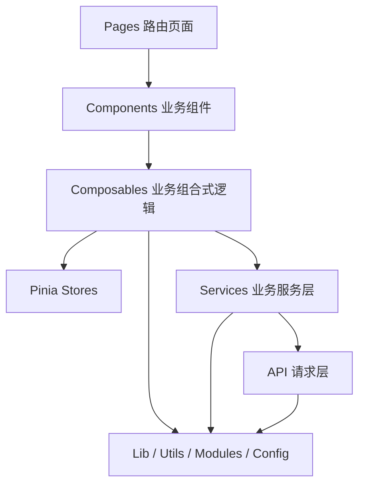
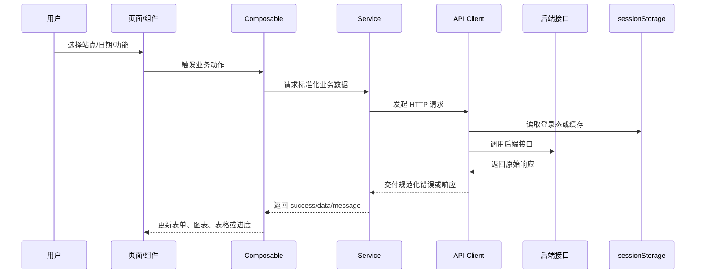

# 气象数据分析与预测客户端设计文档

## 1. 建设背景与目标

`meteo-data-process-client` 是面向气象数据处理场景的前端客户端，目标是将站点数据查询、同步接入、清洗分析与模型预测整合到同一套 Web 界面中，降低业务操作门槛，并为后续扩展更复杂的数据分析能力提供稳定前端基础。

本项目当前设计目标如下：

- 为已登录用户提供统一的气象数据工作台
- 对站点数据提供可筛选、可分页、可视化的查询与分析能力
- 将同步、清洗、分析、预测等异构操作收敛到一致的交互体验
- 在前端内部形成清晰的分层架构，控制组件复杂度和后续维护成本
- 为工程升级后的 Vue 3 + Vite + Pinia 版本建立可持续演进的文档基线

## 2. 系统上下文与技术栈

### 2.1 系统上下文

本项目位于前后端分离架构中的前端展示层，直接面向业务用户，依赖后端提供认证、站点、气象统计、同步、分析和预测能力。



### 2.2 技术栈

- Vue 3：负责页面与组件渲染
- Vite 5：负责开发服务器与生产构建
- Pinia：负责全局状态管理
- Vue Router 4：负责页面路由和访问控制
- Element Plus：负责表单、表格、弹窗、卡片等组件
- Axios：负责接口请求与拦截器机制
- ECharts 5：负责折线图与热力图展示
- Vitest + jsdom：负责单元测试
- ESLint：负责基础代码规范校验

## 3. 总体架构与核心数据流

### 3.1 总体架构

前端采用“页面驱动 + 组合式逻辑 + 服务层封装 + 基础设施封装”的分层组织方式。页面负责组装组件，组件负责表达界面，组合式函数负责流程，服务层负责业务结果整形，接口层负责原始请求。



### 3.2 核心数据流

以下数据流覆盖本项目最核心的操作闭环：



## 4. 模块设计

### 4.1 鉴权与路由

职责：

- 维护登录弹窗、加载状态与会话信息
- 控制未登录用户访问受保护页面
- 将首页作为访客入口，将主页面作为登录后默认入口

设计要点：

- `src/stores/auth.js` 保存弹窗状态、登录态及 `isAuthenticated` 派生状态
- `src/lib/storage.js` 负责登录会话的读写与结构校验
- `src/router/index.js` 在全局前置守卫中统一执行访问控制
- `src/router/guards.js` 使用纯函数 `evaluateRouteAccess` 判断是否放行、跳转到哪里

当前受保护页面：

- `/main`
- `/dataAnalyze`
- `/modelPrediction`

### 4.2 站点与日期

职责：

- 获取站点列表
- 获取某站点可用日期
- 为查询、分析、预测和月度统计提供统一的时间边界约束

设计要点：

- `src/service/station-service.js` 统一封装站点接口的异常处理与结果结构
- `src/composables/useStationDates.js` 负责根据站点变化自动拉取有效日期，并暴露加载态和错误信息
- 多个业务模块共享同一套有效日期能力，避免日期约束分散在多个组件中

### 4.3 查询模块

职责：

- 支持按小时、按天、按时间范围、按复合条件检索气象数据
- 统一装配表格列头、表格内容和分页信息

设计要点：

- `src/composables/useMainQuery.js` 负责表单联动、日期修正、复合条件编辑、查询和翻页
- `src/modules/query/query-helpers.js` 提供查询类型常量、要素排序、分页偏移、范围校正、条件载荷构造等纯函数
- `src/service/meteo-data-service.js` 根据查询类型分发到不同接口，并统一返回 `success/list/total/message`

界面行为：

- 查询类型切换时自动刷新时间输入规则
- 复合条件查询时，条件编辑弹窗会动态根据当前选择的气象要素生成输入字段
- 表格列头由已选气象要素生成，保持参数与结果一致

### 4.4 同步与清洗模块

职责：

- 连接远端同步服务
- 同步站点目录和远端日期范围
- 计算每个站点待同步与待清洗的日期集合
- 批量执行同步和清洗，并展示进度

设计要点：

- `src/composables/useSyncTasks.js` 负责整体任务流程编排
- `src/service/sync-service.js` 封装同步服务接口
- `src/modules/sync/sync-helpers.js` 提供日期排序、计数和进度计算
- `src/lib/storage.js` 以站点为粒度缓存待处理日期，提升批处理流程的连续性

流程说明：

1. 连接同步服务
2. 同步站点目录
3. 同步远端日期范围
4. 获取本地有效日期与远端状态
5. 计算待同步日期与待清洗日期
6. 按站点逐日执行
7. 完成后刷新状态

### 4.5 相关性分析模块

职责：

- 让用户选择站点、时间范围和多个气象要素
- 获取相关性矩阵并转为热力图展示

设计要点：

- `src/composables/useDataAnalysis.js` 管理表单、请求与图表数据
- 通过 `requestId` 防止异步请求竞争导致旧数据覆盖新数据
- `src/service/chart-service.js` 将相关性矩阵转换为 ECharts 热力图数据结构

交互特征：

- 至少需要两个气象要素才能启动分析
- 时间范围会受站点有效日期约束
- 分析结果与所选气象要素列表一一对应

### 4.6 模型预测模块

职责：

- 管理预测方案、站点和日期
- 发起预测请求与报告请求
- 将模型输出转换为表格可直接消费的结构

设计要点：

- `src/composables/usePrediction.js` 管理预测参数、方案切换和结果请求
- `src/modules/prediction/prediction-helpers.js` 负责模型类型映射、未来时间轴生成、结果格式化和报告格式化
- `src/stores/prediction.js` 负责预测结果、模型列表和展示状态共享

实现价值：

- 将短期预测和长期预测统一进同一套页面结构
- 用助手函数屏蔽模型类型映射与时间轴生成差异
- 让结果表格和模型报告有清晰的数据边界

## 5. 分层设计

### 5.1 page

页面层负责路由级入口与大区域布局，当前页面包括：

- `IndexPage.vue`
- `MainPage.vue`
- `DataAnalyzePage.vue`
- `ModelPredictionPage.vue`

### 5.2 component

组件层负责卡片、表单、表格、头部导航、图表等具体界面呈现，原则上不承担复杂业务编排。

### 5.3 composable

组合式函数承载页面级业务流程，是本次架构升级后的核心层。它们组织表单状态、异步请求、联动逻辑与用户反馈，减少页面组件与服务层的直接耦合。

### 5.4 store

Pinia store 只保存跨组件共享且具有会话期价值的数据，例如登录态、站点上下文和预测结果。短期局部状态尽量保留在 `composable` 中。

### 5.5 service

服务层将接口响应统一转换为稳定结构，典型输出格式为：

- `success`
- `data` 或 `list`
- `message`
- `total`

这样上层界面可以使用统一的成功/失败处理方式，而不需要关心不同接口的字段差异。

### 5.6 api

接口层只负责声明请求地址、请求方法、参数和请求元数据，例如是否需要鉴权、是否允许超时重试。

### 5.7 lib / utils / modules

- `lib/http`：统一 Axios 实例、鉴权头注入、错误规范化、超时重试
- `lib/storage`：统一浏览器会话缓存
- `modules`：以纯函数形式承载可测试的业务逻辑
- `utils`：通用转换与资源路径方法
- `config`：页面配置与部分展示文案

## 6. 状态管理与缓存策略

### 6.1 全局状态

当前全局状态的职责划分如下：

- `auth`：登录态与鉴权 UI
- `main-page`：站点上下文与查询类型
- `prediction`：预测结果和模型展示状态

### 6.2 会话缓存

会话缓存使用 `sessionStorage`，原因如下：

- 数据只需要在当前浏览器会话中生效
- 不需要长期持久化
- 适合保存同步任务上下文与临时登录态

缓存项包括：

- `meteo.auth`
- `meteo.sync.stations`
- `meteo.sync.station.{station}`
- `meteo.clean.station.{station}`

### 6.3 一致性策略

- 登录态每次路由跳转前重新水合，避免刷新后 Pinia 丢失状态
- 同步与清洗流程结束后强制重新计算待处理状态
- 站点切换时重新拉取有效日期，防止使用旧站点的时间范围

## 7. 错误处理与异常降级

### 7.1 HTTP 层

- Axios 拦截器统一规范化错误对象
- 对需要重试的请求，通过 `meta.retryOnTimeout` 在超时场景下自动重试一次

### 7.2 服务层

- 每个服务函数都通过 `try/catch` 返回稳定结果结构
- 优先透传接口错误信息，缺失时使用前端兜底文案

### 7.3 交互层

- 页面通过 `ElMessage` 向用户反馈错误、警告与成功消息
- 无数据场景下使用空状态或空表格替代报错中断
- 对日期和条件输入做前置校验，优先在前端阻断无效请求

### 7.4 并发安全

- 相关性分析通过 `requestId` 防止旧请求回写
- 日期和站点联动通过 `watch` 串联，保证状态变更后自动回收无效输入

## 8. 测试策略与构建验证

### 8.1 当前测试覆盖

当前已经具备的测试覆盖点包括：

- 路由守卫跳转判定
- 查询辅助函数
- 预测辅助函数
- 同步辅助函数
- 存储辅助函数
- 预测页站点选择组件的事件行为

### 8.2 验证链路

提交前建议执行以下命令：

```bash
npm run lint
npm run test
npm run build
```

其中：

- `lint` 用于发现语法与规范问题
- `test` 用于验证纯函数和关键组件行为
- `build` 用于验证 Vite 配置、路由懒加载与依赖分包是否正常

## 9. 后续可演进点

在不改变当前已实现能力的前提下，后续可以考虑以下方向：

- 增加接口契约文档或本地 mock 层，降低联调门槛
- 为同步与清洗任务补充失败重试和中断恢复机制
- 为预测结果增加趋势图或对比图，提升可解释性
- 将配置 JSON 中的文案与要素信息逐步收敛到更稳定的常量与国际化方案
- 补充更多组件级测试和服务层测试，提升回归信心

## 10. 结论

当前版本已经形成较清晰的前端业务分层：路由负责入口控制，Pinia 负责跨区域共享状态，`composables` 负责流程编排，`service/api` 负责接口隔离，`lib/modules` 负责基础设施和纯函数支撑。该结构既支撑了查询、同步、分析、预测四类核心业务，也为后续扩展更复杂的数据分析能力保留了足够的演进空间。
